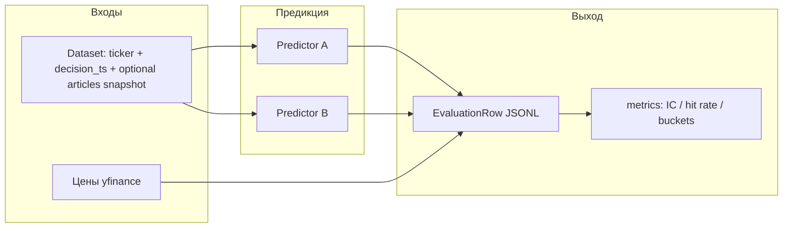

# Архитектура tradenews

Цель: воспроизводимо сравнивать **несколько подходов к новостному сигналу** (локальные Ollama-модели, промпты, агрегаторы, эталонный пайплайн nyse) по **одной и той же методике метрик** на **одном и том же тестовом наборе**.

---

## 1. Поток данных



- **Dataset** — список «решений»: для каждой строки известны `ticker`, `decision_ts_utc` (момент, *до* которого разрешены новости/цены для predict), опционально **снимок статей** (для честного сравнения моделей на одном контенте).
- **Predictor** — абстракция: на вход снимок контекста → на выход скаляр(ы) `bias_predict`, `confidence_predict`, `model_id`, метаданные.
- **Valuation** — *после* фиксации точки во времени подтягиваются **только будущие** цены для расчёта `forward_log_return_h` (лог-доходность, горизонты из конфига).
- **Metrics** — считаются **только по таблице строк** (не требуют повторного вызова LLM).

---

## 2. Контракты

### 2.1 `news.predict` (то, что сравниваем)

Минимум для строки оценки:

| Поле | Смысл |
|------|--------|
| `model_id` | Идентификатор варианта: `ollama:qwen2.5:7b`, `nyse:baseline`, `prompt:v2`, … |
| `bias_predict` | Скаляр в духе `AggregatedNewsSignal.bias` \([-1, 1]\) |
| `confidence_predict` | Опционально, для калибровочных метрик |

Расширения: сырой JSON от модели, хэш промпта, версия агрегатора.

### 2.2 `news.val` (цель для офлайн-метрик)

| Поле | Смысл |
|------|--------|
| `forward_log_return_1d` | \(\ln P_{t+h} - \ln P_t\) в точке закрытия / выбранной схеме |
| … | Аналогично для `3d`, `5d` при необходимости |

Правило: **в момент `decision_ts` не используются цены и котировки строго после `t` для расчёта predict**; `val` использует только **будущие** относительно `decision_ts` цены (или close следующей сессии — фиксируется в конфиге прогона).

### 2.3 Разделение ролей

- **Генерация строк** (`runner`, позже): dataset + predictors + yfinance → JSONL.
- **Сравнение моделей** (`tradenews.compare`): одна таблица с колонкой `model_id` → IC, hit rate, страты.
- **Бенчмарк** (`tradenews.benchmark_report`, CLI `scripts/run_model_benchmark.py`): те же метрики сразу по горизонтам 1d/3d/5d + рейтинг по Spearman IC + опциональный JSON-отчёт.

Так **интеллект** (Ollama / OpenAI / nyse LLM) изолирован в предикторах; **метрики** — чистые функции над числами.

---

## 3. Пакеты в репозитории

```
tradenews/
  pyproject.toml
  README.md
  docs/
    architecture.md          # этот файл
  tradenews/
    schemas.py                 # EvaluationRow, DatasetPoint
    metrics.py                 # Spearman IC, directional hit rate, bucket stats
    valuation.py               # forward log-returns из yfinance
    io.py                      # JSONL read/write
    compare.py                 # агрегация по model_id
    benchmark_report.py        # сводный отчёт по нескольким forward_log_return_*
    predictors/
      base.py                  # протокол NewsPredictor
      ollama.py                # OllamaNewsPredictor: /api/chat + JSON items + агрегат L5
      (ollama_client, prompt_news_signal, signal_aggregate — рядом в tradenews/)
      nyse_reference.py        # опционально: вызов nyse при заданном NYSE_PROJECT_ROOT
  scripts/
    run_compare.py             # CLI: metrics по JSONL (один горизонт)
    run_model_benchmark.py     # CLI: бенчмарк по 1d/3d/5d + --report-json
  tests/
    test_metrics.py
```

---

## 4. Предикторы (план)

| Класс | Назначение |
|-------|------------|
| `OllamaNewsPredictor` | Локальные `llama3.2:3b`, `qwen2.5:7b`: тот же JSON-схемный выход, что ожидает nyse L5, затем агрегация в один `bias` (как `aggregate_news_signals`). |
| `OpenAINewsPredictor` | OpenAI-совместимый `POST /v1/chat/completions`: те же сообщения (`build_ollama_messages`) и тот же разбор `items` → `bias` (бенчмарк против Ollama). |
| `NysePipelinePredictor` | Эталон: `run_news_signal_pipeline` из nyse при тех же статьях и гейте (для регрессии методики). |

Инстансы отличаются **`model_id`** и параметрами в конструкторе.

---

## 5. Метрики (реализованные в коде)

- **IC (Spearman)** между `bias_predict` и `forward_log_return_*`.
- **Hit rate** по знаку: \(\mathrm{sign}(\texttt{bias}) = \mathrm{sign}(r)\) на подвыборке с \(|\texttt{bias}| \ge \varepsilon\).
- **По бакетам** `confidence_predict` — средний forward return и покрытие (заготовка под калибровку).
- **Бенчмарк**: `python scripts/run_model_benchmark.py runs/eval.jsonl --report-json runs/benchmark.json` или `--build … --out-jsonl …` после `build_eval_from_points`.

End-to-end **fusion с техникой** (как в `TradeBuilder`) можно добавить отдельным слоем, подмешивая сохранённый `tech.bias` к строкам датасета — в базовой версии фокус на **чистом новостном слое**.

---

## 6. Зависимость от nyse

- **Обязательная:** нет (метрики и valuation автономны).
- **Опциональная:** клон nyse рядом; `NYSE_PROJECT_ROOT` в `sys.path` для `NysePipelinePredictor` и общих `domain` / `aggregate_news_signals`.

---

## 7. Фикстуры и датасет

Формат JSON-массива статей совместим с nyse `serialize_news_article`; проще всего собирать выгрузкой `scripts/fetch_nyse_articles_fixture.py` или вручную. Подробно: **`fixtures.md`**.

Операционный датасет точек и статей: каталог **`datasets/`**, спецификация и метрики — **`dataset_and_metrics_plan.md`**, сборка JSONL: **`scripts/build_eval_from_points.py`**.

## 8. Следующие шаги (вне этого PR)

1. Скрипт **сборки датасета** из списка точек `(ticker, decision_ts)` + фикстуры статей + valuation.
2. Полная реализация **Ollama**-предиктора с парсингом в ту же схему, что `NewsSignalLLMResponse`.
3. Опционально: импорт длинной истории из **PostgreSQL** (lse) в тот же JSON-формат.
4. CI: pytest без сети на синтетических рядах и `minimal_example.json`.
